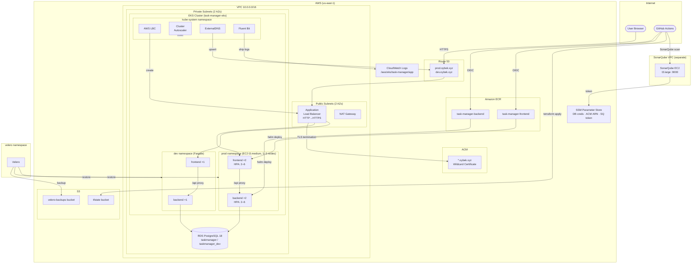

# Task Manager — Infrastructure

Production-grade Kubernetes infrastructure on AWS EKS for a FastAPI + React task management application. Two isolated environments (prod/dev) with full CI/CD, TLS, autoscaling, logging, and code quality gates.

---

## Architecture

```
                          ┌─────────────────────────────────────────┐
                          │              GitHub Actions             │
                          │  ┌──────────┐  ┌────────┐  ┌─────────┐  │
                          │  │ hadolint │  │ Trivy  │  │Sonarube │  │
                          │  └──────────┘  └────────┘  └─────────┘  │
                          └────────────────────┬────────────────────┘
                                               │ push image
                                               ▼
                                    ┌──────────────────┐
                                    │   Amazon ECR      │
                                    │ task-manager-*    │
                                    └────────┬─────────┘
                                             │ helm deploy
                          ┌──────────────────▼──────────────────────┐
                          │            AWS EKS Cluster              │
                          │                                         │
                          │  ┌─────────────────────────────────┐    │
                          │  │         kube-system             │    │
                          │  │  AWS LBC · external-dns         │    │
                          │  │  Cluster Autoscaler · Fluent Bit│    │
                          │  └─────────────────────────────────┘    │
                          │                                         │
                          │  ┌──────────────┐  ┌────────────────┐   │
                          │  │ prod (EC2)   │  │  dev (Fargate) │   │
                          │  │ 2× frontend  │  │  1× frontend   │   │
                          │  │ 2× backend   │  │  1× backend    │   │
                          │  └──────┬───────┘  └───────┬────────┘   │
                          └─────────┼──────────────────┼────────────┘
                                    │                  │
                          ┌─────────▼──────────────────▼────────────┐
                          │         Application Load Balancer       │
                          │     HTTP → HTTPS redirect (ACM cert)    │
                          └─────────────────┬───────────────────────┘
                                            │
                          ┌─────────────────▼────────────────────────┐
                          │               Route 53                   │
                          │  prod.oybek.xyz · dev.oybek.xyz          │
                          └──────────────────────────────────────────┘

  ┌──────────────────────┐    ┌───────────────────────┐
  │   RDS PostgreSQL     │    │  CloudWatch Logs      │
  │  taskmanager (prod)  │    │  /aws/eks/task-manager│
  │  taskmanager_dev     │    │  /app                 │
  └──────────────────────┘    └───────────────────────┘

  ┌──────────────────────────────────────────────────┐
  │  SonarQube EC2 (t3.large, separate Terraform)    │
  │  http://54.221.157.143:9000                      │
  │  Credentials auto-stored in SSM Parameter Store  │
  └──────────────────────────────────────────────────┘
```

---

## Stack

| Layer | Technology |
|-------|-----------|
| Cloud | AWS (EKS, RDS, ECR, ALB, ACM, Route53, CloudWatch, S3) |
| Container orchestration | Kubernetes (EKS) |
| Infrastructure as Code | Terraform 1.10 |
| Package manager | Helm |
| CI/CD | GitHub Actions (OIDC — no long-lived keys) |
| Code quality | SonarQube, hadolint, Trivy, tflint |
| DNS | Route53 + ExternalDNS (auto-creates records from Ingress) |
| TLS | ACM wildcard certificate (`*.oybek.xyz`) |
| Logging | Fluent Bit DaemonSet → CloudWatch Logs |
| Node autoscaling | Cluster Autoscaler (prod EC2 nodes) |
| Pod autoscaling | HorizontalPodAutoscaler (prod: 2–6 replicas) |
| Backup / DR | Velero + S3 (cluster state + PV snapshots) |

---

## Repository Structure

```
task-manager-infra/
├── terraform/                  # Main infrastructure (single Terraform state)
│   ├── vpc.tf                  # VPC, subnets, NAT gateway
│   ├── eks.tf                  # EKS cluster, node groups, Fargate profile
│   ├── rds.tf                  # RDS PostgreSQL
│   ├── ecr.tf                  # ECR repositories (backend + frontend)
│   ├── acm.tf                  # ACM wildcard certificate + Route53 DNS validation
│   ├── alb.tf                  # AWS LBC IRSA role + EKS OIDC provider
│   ├── ca.tf                   # Cluster Autoscaler IRSA role
│   ├── cloudwatch.tf           # CloudWatch log group + node IAM policy
│   ├── github-oidc.tf          # GitHub Actions OIDC federation + IAM role
│   ├── velero.tf               # Velero S3 bucket + IRSA role (backup/DR)
│   ├── lbc-policy.json         # AWS Load Balancer Controller IAM policy
│   ├── ca-policy.json          # Cluster Autoscaler IAM policy
│   └── ci-policy.json          # GitHub Actions CI/CD IAM policy
├── terraform-sonarqube/        # SonarQube EC2 (separate state, never auto-destroyed)
│   ├── main.tf                 # VPC + AMI data sources
│   ├── sonarqube.tf            # EC2, IAM, EIP, user-data auto-setup
│   └── backend.tf              # S3 state: sonarqube/terraform.tfstate
├── helm/task-manager/          # Helm chart (shared by frontend & backend)
│   ├── templates/
│   │   ├── frontend.yaml       # Deployment (SecurityContext) + ClusterIP Service
│   │   ├── backend.yaml        # Deployment (SecurityContext) + ClusterIP Service
│   │   ├── ingress.yaml        # ALB Ingress with TLS + ExternalDNS annotation
│   │   ├── hpa.yaml            # HorizontalPodAutoscaler (CPU + memory metrics)
│   │   └── db-init-job.yaml    # Helm post-install Job (creates DB schema)
│   ├── values.yaml             # Base defaults
│   ├── values-prod.yaml        # Prod: 2 replicas, EC2 nodes, HPA enabled (2–6)
│   └── values-dev.yaml         # Dev: 1 replica, Fargate, HPA disabled
└── .github/workflows/
    ├── ci.yml                  # Lint → Plan → Apply → Helm installs (incl. Velero)
    ├── destroy.yml             # Manual tear-down (uninstalls Helm + terraform destroy)
    └── sonarqube.yml           # SonarQube EC2 deploy (manual trigger)
```

---

## Environments

| | prod | dev |
|-|------|-----|
| URL | `https://prod.oybek.xyz` | `https://dev.oybek.xyz` |
| Branch | `main` | `dev` |
| Compute | EC2 `t3.medium` (autoscaled 1–3) | AWS Fargate |
| Replicas | 2 | 1 |
| Database | `taskmanager` | `taskmanager_dev` |
| Node selector | `environment: prod` | — |

---

## CI/CD Pipeline

### Infra pipeline (`ci.yml`)

```
push to main
    └── lint (terraform fmt + tflint)
         └── apply
              ├── Bootstrap ACM certificate (-target)
              ├── Import existing GitHub OIDC resources
              ├── terraform apply (full)
              ├── Configure kubectl
              ├── Install: external-dns
              ├── Install: Cluster Autoscaler
              ├── Install: Fluent Bit
              ├── Install: AWS Load Balancer Controller
              ├── Wait for LBC ready
              └── Create namespaces + db-secrets
```

### App pipeline (frontend / backend)

```
push to main or dev
    ├── hadolint       — Dockerfile linting
    ├── SonarQube      — code quality scan (reads from SSM)
    ├── Trivy          — container vulnerability scan
    └── push to ECR
         ├── main → helm deploy to prod namespace
         └── dev  → helm deploy to dev namespace
```

---

## Terraform State

| State | S3 Key | Contains |
|-------|--------|----------|
| Main infra | `terraform.tfstate` | EKS, RDS, VPC, ACM, IAM |
| SonarQube | `sonarqube/terraform.tfstate` | EC2, EIP, VPC |

Both stored in S3 bucket: `task-manager-tfstate-infra`

---

## Deployment

### Prerequisites
- AWS CLI configured
- Terraform 1.10+
- kubectl + Helm

### First-time deploy
```bash
# Deploy main infrastructure
cd terraform
terraform init
terraform apply -target=aws_acm_certificate.main -auto-approve
terraform apply -auto-approve

# Deploy SonarQube (separate state, never destroyed with main infra)
cd ../terraform-sonarqube
terraform init
terraform apply -auto-approve
```

### Destroy
Trigger the **Terraform Destroy** workflow manually in GitHub Actions.
SonarQube is protected with `prevent_destroy = true` and will not be affected.

---

## Monitoring

- **Logs**: AWS CloudWatch → Log groups → `/aws/eks/task-manager/app` (7-day retention, shipped by Fluent Bit)
- **Code quality**: SonarQube at `http://54.221.157.143:9000` (credentials in SSM)
- **Node autoscaling**: EKS → task-manager-eks → Compute → task-manager-prod-nodes (Cluster Autoscaler, 1–3 nodes)
- **Pod autoscaling**: HPA on backend + frontend in prod namespace (2–6 replicas, CPU 70% / memory 80% targets)

---

## Backup & Disaster Recovery (Velero)

Velero is deployed in the `velero` namespace and configured with an S3 backend (`task-manager-velero-backups`).

```bash
# Trigger a manual cluster backup
velero backup create manual-backup --include-namespaces prod,dev

# List backups
velero backup get

# Restore from a backup
velero restore create --from-backup manual-backup

# Schedule automatic daily backups
velero schedule create daily-backup \
  --schedule="0 2 * * *" \
  --include-namespaces prod,dev \
  --ttl 168h0m0s    # 7 days retention
```

Velero uses IRSA (IAM Roles for Service Accounts) — no static AWS credentials stored in the cluster.

---

## Infrastructure Diagram



The diagram above covers:
- **Traffic flow**: User → Route53 → ALB (TLS) → nginx frontend → FastAPI backend → RDS
- **CI/CD flow**: GitHub Actions (OIDC) → ECR → Helm → EKS namespaces
- **Cluster internals**: ExternalDNS (DNS sync), AWS LBC (ALB provisioning), Cluster Autoscaler (node scaling), Fluent Bit (log shipping), Velero (backup)
- **State management**: Terraform state in S3, Velero backups in S3
